# Animierte Logos — zum Wiederverwenden

Eigenständige Dateien, die du in anderen Projekten einsetzen kannst.

| Datei | Inhalt | Animation |
|-------|--------|-----------|
| `htl1-logo-animated.svg` | HTL1 Lastenstraße + drehender Wireframe-Globus + einschwenkender Orbit | JS (im SVG eingebettet) |
| `kranzlab-animated.svg` | kranzlab — Mond + Wortmarke + einschwenkende Welle & Punkte | CSS + SMIL |
| `kranzlab-footer.svg` | kranzlab klein/dezent — Mond + Wortmarke | SMIL (Mond rotiert) |

## Einbinden

### kranzlab (beide Versionen) — einfach als Bild
Funktioniert direkt als `` (CSS- & SMIL-Animationen laufen):
```html


```
> Hinweis: Die Wortmarke nutzt die Schrift **Poppins** (animiert) bzw. eine System-Sans (Footer). Für 1:1-Optik Poppins im Projekt laden:
> `<link href="https://fonts.googleapis.com/css2?family=Poppins:wght@600&display=swap" rel="stylesheet">`

### HTL1-Logo — als `<object>` oder inline (Script muss laufen)
Der Globus/Orbit wird per eingebettetem Script gezeichnet. Als reines `` läuft kein Script → dann nur statisch. Daher:

```html
<!-- Variante A: object -->
<object type="image/svg+xml" data="htl1-logo-animated.svg" style="width:240px"></object>

<!-- Variante B: SVG-Inhalt direkt in die Seite kopieren (Script läuft mit) -->
```

Das Logo ist transparent und passt auf hellen wie dunklen Hintergrund (Buchstaben weiß/Outline, „1"/„Lastenstraße" orange, Globus/Orbit teal).

## Demo
`demo.html` im selben Ordner zeigt alle drei auf dunklem Hintergrund.
